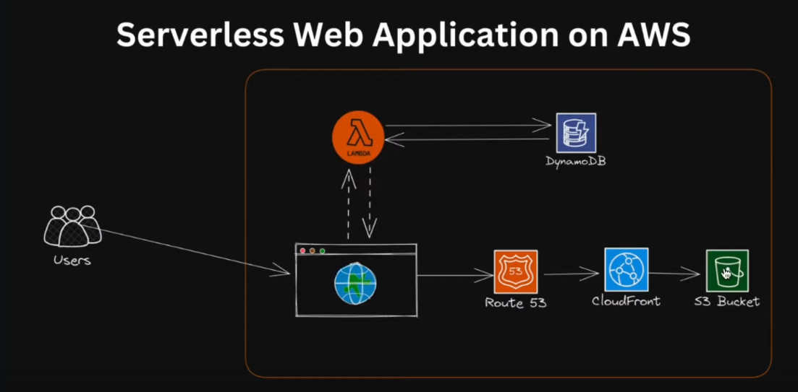

# Serverless web application developed on the Amazon Web Services (AWS) platform 
Developed Serverless web application with in two ways first is on GUI and second is Infrastructured as a code 

    Project Planning: Goal is a scalable, cost-effective serverless solution using AWS IAM, Lambda, API Gateway, DynamoDB, S3, CloudFormation, and CloudWatch.

    Architecture Design: Determine AWS services for scalability, security, and performance.

    Environment Setup: Create AWS Account, Configure IAM roles, Install necessary development tools and SDKs.

    Frontend Development: Build UI with HTML, CSS, and JS.

    Backend Development: Design and implement serverless functions with AWS Lambda. Use API Gateway for endpoints.

    Data Management: Configure Amazon DynamoDB and S3 for data storage.

    Authentication & Authorization: Implement user security with AWS Cognito or other authentication services.

    Monitoring & Maintenance: Utilize AWS CloudWatch for monitoring, setting alarms, and issue troubleshooting.
    
Skills: Amazon S3 · AWS LAMDA · AWS API GATEWAY · AWS DynamoDB · Amazon CloudWatch
