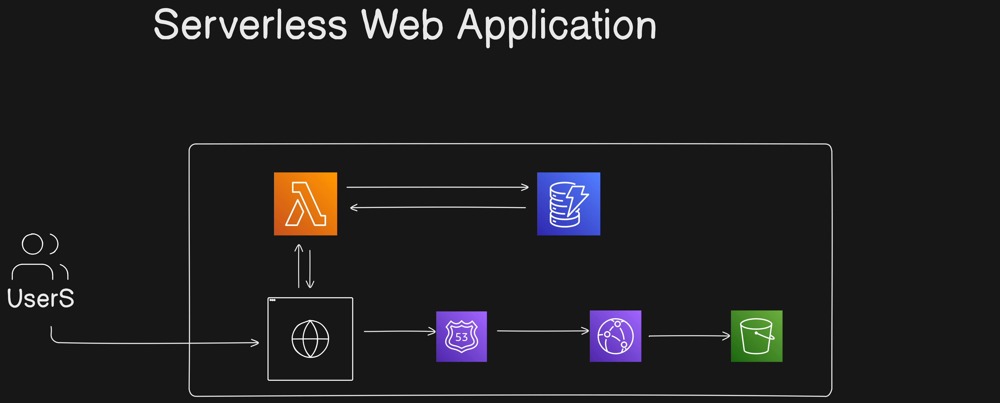

# Serverless Web Application on AWS

This project is a fully serverless web application deployed on Amazon Web Services (AWS), designed to be scalable, cost-effective, and highly available. The application is developed in two ways: via the AWS Management Console (GUI) and using Infrastructure as Code (IaC) through AWS CloudFormation.

## Project Overview

### Goal
Build a scalable, cost-effective serverless solution with AWS services, including IAM, Lambda, API Gateway, DynamoDB, S3, CloudFormation, and CloudWatch.

### Key Features
- **Serverless architecture** for reduced management overhead.
- **Scalability** and **reliability** using AWS native services.
- **Cost-effectiveness** by using pay-as-you-go services like Lambda and DynamoDB.

---

## Table of Contents
- [Architecture](#architecture)
- [Technologies Used](#technologies-used)
- [Workflow](#workflow)
- [Project Structure](#project-structure)
- [Setup Instructions](#setup-instructions)
- [Monitoring & Maintenance](#monitoring--maintenance)

---


## Architecture



The web application consists of the following AWS components:

- **API Gateway** - Serves as the HTTP interface for Lambda functions.
- **AWS Lambda** - Executes backend functions in a serverless environment.
- **Amazon DynamoDB** - Provides fast, flexible NoSQL database storage.
- **Amazon S3** - Hosts static files, including frontend assets.
- **Amazon Cognito** (optional) - Manages user authentication and authorization.
- **CloudWatch** - Monitors resources, tracks application performance, and sets alarms.

## Technologies Used

- **Frontend**: HTML, CSS, JavaScript
- **Backend**: AWS Lambda (Node.js/Python)
- **Data Management**: DynamoDB for data storage, S3 for asset storage
- **API Management**: AWS API Gateway
- **Authentication**: AWS Cognito (optional)
- **Infrastructure as Code (IaC)**: AWS CloudFormation
- **Monitoring**: Amazon CloudWatch

---

## Workflow

### 1. Project Planning
   - **Objective**: Create a serverless web application using a combination of AWS services.
   - **Outcome**: A scalable, cost-effective serverless solution.

### 2. Architecture Design
   - Decide on suitable AWS services for scalability, security, and performance.
   - Create a detailed architecture diagram.

### 3. Environment Setup
   - Create an AWS account, configure IAM roles with least privilege access.
   - Install required tools: AWS CLI, AWS SDK, and set up local development environment.

### 4. Frontend Development
   - Build UI using HTML, CSS, and JavaScript.
   - Host the frontend on Amazon S3 for scalability and low latency.

### 5. Backend Development
   - Develop serverless functions with AWS Lambda.
   - Use API Gateway to expose Lambda functions as RESTful endpoints.

### 6. Data Management
   - Configure DynamoDB for application data storage and retrieval.
   - Utilize Amazon S3 for frontend assets and file storage.

### 7. Authentication & Authorization
   - Implement user security with AWS Cognito (optional) or other authentication mechanisms.

### 8. Monitoring & Maintenance
   - Use CloudWatch for logging, metrics, and monitoring Lambda functions and other AWS services.
   - Set up alarms to notify of potential issues.

---

## Project Structure

```
.
├── cloudformation/           # CloudFormation templates for IaC
├── frontend/                 # HTML, CSS, and JavaScript files
├── lambda_functions/         # Backend code for AWS Lambda functions
├── assets/                   # Static assets stored in Amazon S3
├── README.md                 # Project documentation
└── config/                   # Configuration files
```

---

## Setup Instructions

1. **Clone the repository**
    ```bash
    git clone https://github.com/atharvapatil1210/serverless_webapplication.git
    cd serverless_webapplication
    ```

2. **Setup AWS CLI**
   - Configure AWS CLI with your AWS credentials:
     ```bash
     aws configure
     ```

3. **Deploy with CloudFormation**
   - Use CloudFormation templates in `cloudformation/` to set up the infrastructure.

4. **Deploy Frontend**
   - Upload the `frontend/` files to an S3 bucket.
   - Configure the bucket to host a static website.

5. **Deploy Backend**
   - Deploy Lambda functions from `lambda_functions/` and set up API Gateway endpoints.

---

## Monitoring & Maintenance

- **Amazon CloudWatch**: View real-time logs, metrics, and monitor application health.
- **Alarms**: Configure alarms for high error rates or latency issues.

---

## Skills Demonstrated

- **AWS S3** - For static website hosting and asset storage
- **AWS Lambda** - For running backend code in a serverless environment
- **AWS API Gateway** - For creating RESTful APIs
- **AWS DynamoDB** - For NoSQL database storage
- **Amazon CloudWatch** - For logging and monitoring

---

## License

This project is licensed under the MIT License.

For additional details, refer to the GitHub repository: [serverless_webapplication](https://github.com/atharvapatil1210/serverless_webapplication).
